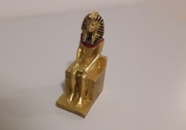
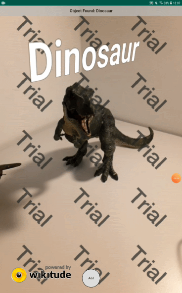
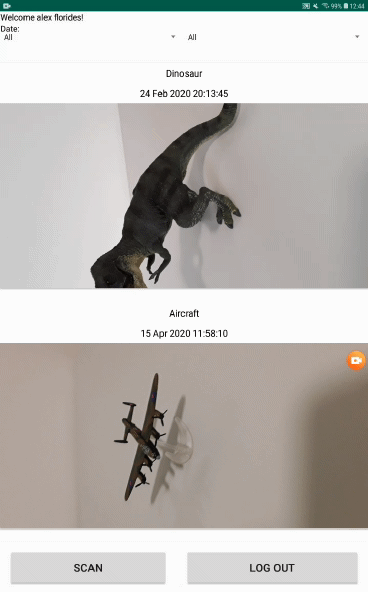
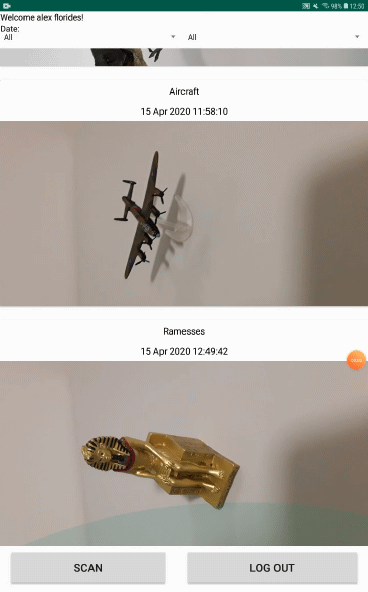
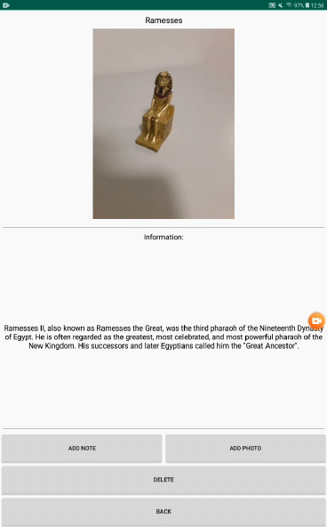
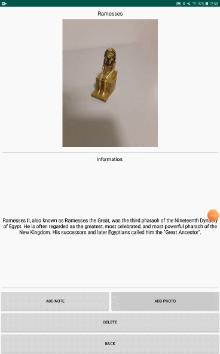

# MuseumAR 

MuseumAR is an Android application that make use Wikitude's Object Recognition feature to identify predefined museum exhibits, show information about them and store them in a database using Google Firebase.

# Motivation

Help tourists and more specifically museum visitors to learn about exhibits in a more fun and immersive way just by using their mobile devices.

# Software Requirements

* Android Studio 

# Hardware Requirements

Mobile device with:
* Android 5.0 (API Level 21) or newer
* Internet access

# Other Requirements

For this application to work as it is, the following artifacts must be owned, which represent some museum exhibits:

* Dinosaur Tyrannosaurus Rex Toys:

   https://www.amazon.co.uk/gp/product/B07PW6SP21/ref=ppx_yo_dt_b_asin_title_o03_s00?ie=UTF8&psc=1 

* Corgi CS90619 Showcase Avro Lancaster Model:

   https://www.amazon.co.uk/gp/product/B01H98GSW4/ref=ppx_yo_dt_b_asin_title_o04_s00?ie=UTF8&psc=1

* Ramesses the Second Seated on Hieroglyphic Throne:

   https://www.amazon.co.uk/gp/product/B0077NSSXE/ref=ppx_yo_dt_b_asin_title_o04_s00?ie=UTF8&psc=1

# Features

*	User Authentication
*	Object recognition
*	User Scrapbook
*	Sort scrapbook by date
*	Delete items from scrapbook
*	Add notes on items
*   Take photos of items

# Installing

* Clone or download repository:

        git clone https://github.com/AlexFlorides/MuseumAR.git

* open project in Android Studio and update any libraries and plugins it might have
* building the project creates an .apk file, located: app\build\outputs\apk\debug
* the file can be used to install the app on a mobile device
* or simply run the project through Android Studio to install it on the connected Android device

# Possible setup changes

The current version of this application works as expected only when the user owns the [above artifacts](#other-requirements). 

In case you want to use the application with other artifacts as museum exhibits, simply follow the steps below:

* Navigate to https://cl.wikitude.com/login and sign in or create an account
* Select 'Create Project' and then 'Object Targets'
* Enter a simple project name and click 'Create'
* Navigate to: https://www.wikitude.com/external/doc/documentation/studio/targetmanagement.html, scroll down to 'Object Targets' heading and follow the instructions

The above steps explain how to create a high quality 3D map of the desired object with the help of Wikitude Studio. You can follow the same steps to create 3D maps for as many objects as you want. Once everything is ready, again follow:

* On top left of the Wikitude Studio website click 'Download WTO', enter your email address and click 'Generate'
* Wait a couple of seconds or minutes and once you receive the email, download to wto file into a desired location.
* Copy that file, open the folder the project is located and go to app\src\main\assets\assets\ and paste the file replacing the old one.

NOTE: when you replace the old wto file with the newly generated one, rebuild the application using Android Studio to apply the changes!

#### EXTRA NOTE:
Since all the details of the exhibits are located in a Google Firebase Database, the newly created 3D maps of the objects will not match with anything on the database, therefore the app will not work as expected. The object recognition functionality will work, but nothing will be added to the scrapbook, therefore user could not have any other interactions with them. Currently the application does not provide an automated functionality to allow users adding details on the database.

For access on the Admin Firebase project, where you could modify anything related to the project, like adding more details on the database for the new objects, feel free to contact me on: alexf_97@hotmail.com, including your Google email address, to give you the appropriate permissions.

# Examples of use

Authentication Screen             |  Object Recognition
:-------------------------:|:-------------------------:
  |  

User Scrapbook             |  Sorting Scrapbook by Date
:-------------------------:|:-------------------------:
  |  

Adding Note             |  Adding Photo
:-------------------------:|:-------------------------:
  |  

# Usage Instructions:
* At the welcome screen select any of the four providers to login or register a new account
* On Date dropdown menus select to either filter by day, month or both at the same time
* Clicking on 'Scan' button it opens the camera to let you scan an exhibit
* When an exhibit has been successfuly recognised click on 'Add' button to add the exhibit to the scrapbook or touch the Back button of the device to return to the scrapbook
* Clicking 'Log Out' button, user is logged out of their account and goes back to the welcome screen
* Clicking and holding on an item in the scrapbook opens up an Action menu with two options, Open and Delete
* On 'Open' click on Action menu or on single click on an item, it opens up a the information screen with more details about the selected item
* On 'Delete' click on Action menu, the selected item is removed from the scrapbook
* While on information screen, clicking on 'Add Note' button a dialog box pops up, along with the keyboard allowing the user to write a note about the item on 'OK' button click or go back by clicking the 'Cancel' button
* While on information screen, clicking on 'Add Photo' button, the camera opens up allowing the user to take a photo of the item or touch the Back button of the device to return to the information screen
* While on information screen, clicking on 'Delete' button, the selected item is removed from the scrapbook and goes back to the scrapbook screen
* While on information screen, clicking on 'Back' button, it goes back to the scrapbook screen
* While on information screen, clicking and holding on a note from the notes list opens up an Action menu with two options, Edit and Delete
* On 'Edit' click on Action menu, it opens up a adialog box, along with the keyboard allowing the user to edit the note on 'OK' button click or go back by clicking the 'Cancel' button
* On 'Delete' click on Action menu, the selected note is removed from the notes list
* While on information screen, clicking and holding on a photo from the album list opens up an Action menu with the 'Delete' option
* On 'Delete' click on Action menu, the selected photo is removed from the album list

# Built with

* [Android Studio](https://developer.android.com/studio) - IDE for Android applications development
* [Google Firebase](https://firebase.google.com/) - Development platform for building mobile and web applications
* [Wikitude Android SDK JavaScript API](https://www.wikitude.com/external/doc/documentation/latest/android/) - Software library and framework for mobile apps used to create augmented reality experiences

# Authors
**Alexandros Florides**

# Acknowledgments
* Appreciation to Dr Michael Gardner and Dr Adrian Clark for their constant help throughout the development of the project
* Gratitude to the Department of CSEE of University of Essex for providing me the required hardware
